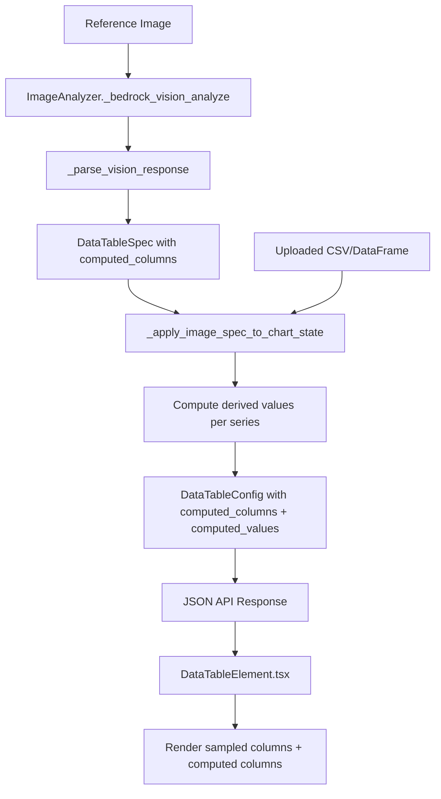

# Design Document: Data Table Computed Columns

## Overview

This feature extends the FRBSF Chart Builder's data table to support computed (derived) columns detected from reference chart images. Currently, the `DataTableElement` renders only raw sampled values from the dataset. Reference images often include derived columns such as "chg" (change between sampled values). The system must detect these via vision analysis, compute the values from actual data, and render them — all driven by what the reference image shows, with nothing hardcoded.

The data flow is:

1. **Vision Analysis** (`ImageAnalyzer`) detects computed columns in the reference image and returns `ComputedColumnDefinition` objects inside `DataTableSpec`.
2. **Ingestion** (`DataIngestionService`) receives the definitions, computes derived values using the actual dataset, and attaches both the definitions and precomputed values to `DataTableConfig` in `ChartState`.
3. **Frontend** (`DataTableElement`) reads the definitions and precomputed values from `DataTableConfig` and renders additional columns after the sampled date columns.

The design is fully dynamic — if the reference image has no computed columns, the system behaves identically to today.

## Architecture



### Key Design Decisions

1. **Precompute on backend**: Derived values are computed in the ingestion service, not the frontend. This keeps the frontend a pure renderer and avoids duplicating formula logic across Python and TypeScript.

2. **Sampled index operands**: Computed column formulas reference sampled date columns by index (e.g., -1 for last, -2 for second-to-last). This matches how the vision model naturally describes "the change between the last two columns."

3. **Standalone `ComputedColumnDefinition` model**: A single Pydantic model reused by both `DataTableSpec` (vision output) and `DataTableConfig` (chart state). This avoids schema drift between the two.

4. **Computed values as a flat dict**: Precomputed values are stored as `computed_values: dict[str, float | None]` keyed by `"{series_column}:{computed_column_label}"`. This is simple to serialize, easy to look up in the frontend, and avoids nested structures.

5. **No hardcoding**: The vision prompt asks the model to detect computed columns generically. The ingestion service applies whatever formulas are returned. The frontend renders whatever computed columns exist in the config.

## Components and Interfaces

### Backend

#### `ComputedColumnDefinition` (new Pydantic model in `schemas.py`)

```python
class ComputedColumnDefinition(BaseModel):
    label: str           # e.g., "chg"
    formula: str         # e.g., "difference", "percent_change"
    operands: list[int]  # sampled indices, e.g., [-1, -2]
```

#### `DataTableSpec` (modified)

Add optional field:
```python
computed_columns: list[ComputedColumnDefinition] = []
```

#### `DataTableConfig` (modified)

Add optional fields:
```python
computed_columns: list[ComputedColumnDefinition] = []
computed_values: dict[str, float | None] = {}
```

#### `ImageAnalyzer._parse_vision_response` (modified)

Parse `computed_columns` from the vision response's `data_table` object and construct `ComputedColumnDefinition` instances.

#### Vision Prompt (modified in `_bedrock_vision_analyze`)

Add instructions to the existing data table section of the prompt asking the model to detect computed/derived columns, their labels, formula types, and which sampled columns they reference.

#### `_apply_image_spec_to_chart_state` (modified in `ingestion.py`)

When `spec.data_table.computed_columns` is non-empty:
1. Copy the `ComputedColumnDefinition` list to `DataTableConfig.computed_columns`.
2. For each series column × each computed column definition, resolve the sampled indices to actual data values and apply the formula.
3. Store results in `DataTableConfig.computed_values`.

#### Formula computation (new helper in `ingestion.py`)

```python
def _compute_derived_value(
    formula: str,
    operand_values: list[float | None],
) -> float | None:
```

Supports "difference" and "percent_change". Returns `None` on division by zero or missing operands.

### Frontend

#### `ComputedColumnDefinition` (new TypeScript interface in `types/index.ts`)

```typescript
export interface ComputedColumnDefinition {
  label: string;
  formula: string;
  operands: number[];
}
```

#### `DataTableConfig` (modified TypeScript interface)

Add optional fields:
```typescript
computed_columns?: ComputedColumnDefinition[];
computed_values?: Record<string, number | null>;
```

#### `DataTableElement.tsx` (modified)

- Read `computed_columns` and `computed_values` from config.
- After rendering sampled date columns, render one additional column per `ComputedColumnDefinition`.
- Header text = the definition's `label`.
- Cell value = lookup `computed_values["{series_column}:{label}"]`, format as number or "—" if null.
- Adjust `tableWidth` to include the extra columns.

## Data Models

### ComputedColumnDefinition

| Field | Type | Description |
|-------|------|-------------|
| `label` | `str` | Display label from reference image (e.g., "chg") |
| `formula` | `str` | Formula type: "difference", "percent_change" |
| `operands` | `list[int]` | Sampled date indices (negative = from end, e.g., [-1, -2]) |

### DataTableSpec (extended)

| Field | Type | Default | Description |
|-------|------|---------|-------------|
| `computed_columns` | `list[ComputedColumnDefinition]` | `[]` | Computed columns detected by vision |
| *(existing fields unchanged)* | | | |

### DataTableConfig (extended)

| Field | Type | Default | Description |
|-------|------|---------|-------------|
| `computed_columns` | `list[ComputedColumnDefinition]` | `[]` | Computed column definitions |
| `computed_values` | `dict[str, float \| None]` | `{}` | Precomputed values keyed by `"{series}:{label}"` |
| *(existing fields unchanged)* | | | |

### DataTableConfig TypeScript (extended)

| Field | Type | Optional | Description |
|-------|------|----------|-------------|
| `computed_columns` | `ComputedColumnDefinition[]` | Yes | Computed column definitions |
| `computed_values` | `Record<string, number \| null>` | Yes | Precomputed values |
| *(existing fields unchanged)* | | | |

### Computed Values Key Format

`"{series_column}:{computed_column_label}"` — e.g., `"PCE:chg"` for the "chg" computed column applied to the "PCE" series.


## Correctness Properties

*A property is a characteristic or behavior that should hold true across all valid executions of a system — essentially, a formal statement about what the system should do. Properties serve as the bridge between human-readable specifications and machine-verifiable correctness guarantees.*

### Property 1: Vision parsing preserves computed columns

*For any* valid vision response JSON containing a `data_table` with a `computed_columns` array of objects (each having `label`, `formula`, and `operands`), parsing via `_parse_vision_response` should produce a `DataTableSpec` whose `computed_columns` list has the same length and matching field values as the input JSON.

**Validates: Requirements 1.1**

### Property 2: Vision parsing defaults to empty computed columns

*For any* valid vision response JSON containing a `data_table` without a `computed_columns` field (or with `computed_columns` set to `null` or `[]`), parsing via `_parse_vision_response` should produce a `DataTableSpec` with `computed_columns == []`.

**Validates: Requirements 1.2, 2.3**

### Property 3: Schema acceptance of computed column definitions

*For any* valid list of `ComputedColumnDefinition` objects (each with a non-empty label string, a formula string from the supported set, and a list of integer operands), both `DataTableSpec` and `DataTableConfig` should accept the list in their `computed_columns` field and round-trip it through `model_dump()` / construction without loss.

**Validates: Requirements 2.1, 2.2, 2.4**

### Property 4: Formula computation correctness

*For any* pair of finite numeric operand values (a, b) where b ≠ 0 for percent_change: applying the "difference" formula should produce `a - b`, and applying the "percent_change" formula should produce `(a - b) / b * 100`. When b = 0 for percent_change, or when any operand is None, the result should be `None`.

**Validates: Requirements 3.2, 3.3, 3.4**

### Property 5: Computation completeness

*For any* DataFrame with N numeric series columns and a list of M `ComputedColumnDefinition` objects, the ingestion service should produce exactly N × M entries in `computed_values`, one for each `"{series_column}:{label}"` key.

**Validates: Requirements 3.1, 3.5**

### Property 6: No computed columns preserves backward compatibility

*For any* DataFrame and chart state where `computed_columns` is empty (or absent), the resulting `DataTableConfig` should have `computed_columns == []` and `computed_values == {}`, and the `columns` list should contain exactly the numeric columns from the DataFrame — identical to the current behavior.

**Validates: Requirements 3.6, 4.5**

### Property 7: DataTableConfig serialization round-trip

*For any* valid `DataTableConfig` containing `computed_columns` and `computed_values`, serializing to JSON via `model_dump_json()` and deserializing back via `DataTableConfig.model_validate_json()` should produce an equivalent object.

**Validates: Requirements 6.1, 6.2**

## Error Handling

| Scenario | Handling |
|----------|----------|
| Vision response has no `computed_columns` key in `data_table` | Default to `[]` — no computed columns |
| Vision response has malformed computed column entry (missing fields) | Skip that entry, log a warning, continue with valid entries |
| Formula type is unrecognized (not "difference" or "percent_change") | Skip computation for that definition, store `None` for all series |
| Operand index out of range (e.g., `-3` when only 2 sampled dates) | Store `None` for that cell |
| Operand value is `None` / `NaN` in the dataset | Store `None` for that cell |
| Division by zero in `percent_change` | Store `None` for that cell |
| Frontend receives `computed_columns` as `undefined` | Treat as empty array, render no extra columns (backward compatible) |
| Frontend receives `computed_values` as `undefined` | Treat as empty dict, display "—" for all computed cells |

## Testing Strategy

### Property-Based Testing

Library: **Hypothesis** (Python) — already in use in the project.

Each property test must run a minimum of **100 iterations** and be tagged with a comment referencing the design property.

Tag format: `Feature: data-table-computed-columns, Property {number}: {property_text}`

| Property | Test Description | Key Generators |
|----------|-----------------|----------------|
| 1 | Generate random vision JSON dicts with computed_columns arrays, parse, verify field preservation | Random strings for labels, sampled_from for formulas, lists of ints for operands |
| 2 | Generate random vision JSON dicts without computed_columns, parse, verify empty list | Random chart types, titles, axis configs |
| 3 | Generate random ComputedColumnDefinition lists, construct DataTableSpec and DataTableConfig, verify acceptance | Random labels, formulas, operand lists |
| 4 | Generate random (a, b) float pairs, apply each formula, verify arithmetic | Floats for operands, include zero and None edge cases |
| 5 | Generate random DataFrames (1-4 numeric cols) and 1-3 computed column defs, run computation, verify N×M keys | Random column names, random formulas |
| 6 | Generate random DataFrames with empty computed_columns, verify output matches current behavior | Random numeric DataFrames |
| 7 | Generate random DataTableConfig with computed_columns and computed_values, round-trip through JSON | Random configs using existing conftest strategies extended with computed column fields |

### Unit Testing

Unit tests complement property tests for specific examples and edge cases:

- **Vision parsing**: Specific example with a "chg" difference column matching the PCE reference image pattern.
- **Formula edge cases**: Division by zero, None operands, NaN values, out-of-range indices.
- **Frontend rendering**: Snapshot/example tests verifying column count, header text, cell values, and table width for a known config with 1-2 computed columns.
- **Backward compatibility**: Existing test suites (`test_data_table_preservation.py`) must continue to pass without modification.

### Test Configuration

- Property tests: `@settings(max_examples=100)` minimum
- Each property test tagged: `# Feature: data-table-computed-columns, Property N: <title>`
- Property-based testing library: Hypothesis (already a project dependency)
- Each correctness property is implemented by a single property-based test function
