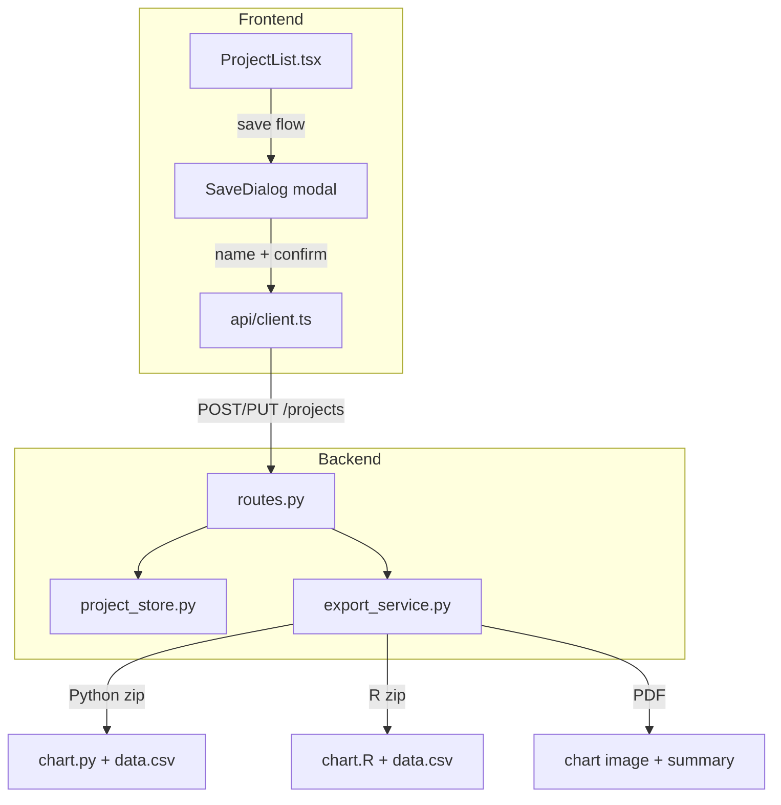

# Design Document: Export and Save Improvements

## Overview

This design covers three improvement areas for the FRBSF Chart Builder:

1. **Named Chart Saves** — Replace the auto-generated timestamp name with a modal dialog that lets users name (and rename) projects on save.
2. **CSV-Based Exports** — Ship `data.csv` inside Python and R zip archives instead of embedding the dataset as a code literal.
3. **Full Canvas Export** — Extend `_render_chart_image`, `_generate_python_script`, and `_generate_r_script` to render every visible canvas element: data table, floating legend entries, all annotation types, and the title at its user-defined position.

All changes are additive. Existing API contracts, database schema, and Pydantic models remain unchanged. The `ChartState` model already carries every field needed (data_table, elements_positions, annotations, title.position).

## Architecture

The feature touches two layers:



No new backend endpoints are needed. The existing `POST /api/projects`, `PUT /api/projects/:id`, and `GET /api/export/*` routes are sufficient. The `ProjectUpdate` schema already accepts an optional `name` field.

### Change Summary

| Area | File(s) | Change |
|------|---------|--------|
| Save dialog | `ProjectList.tsx` (new inline modal) | Add `SaveDialog` component with name input, validation, confirm/cancel |
| App store | `appStore.ts` | Add `currentProjectName` state + setter |
| CSV export | `export_service.py` | Replace `_df_to_python_literal` / `_df_to_r_literal` usage with `data.csv` in zip |
| Full canvas render | `export_service.py` `_render_chart_image` | Add data table, floating legend, vertical lines, text annotations, title positioning |
| Full canvas Python | `export_service.py` `_generate_python_script` | Add code gen for data table, floating legend, vertical lines, text annotations, title positioning |
| Full canvas R | `export_service.py` `_generate_r_script` | Add code gen for data table, floating legend, vertical lines, text annotations, title positioning |

## Components and Interfaces

### 1. SaveDialog Component (Frontend)

A small modal rendered inside `ProjectList.tsx` when the user clicks Save.

```typescript
interface SaveDialogProps {
  defaultName: string;
  onConfirm: (name: string) => void;
  onCancel: () => void;
}
```

Behavior:
- Shown when `handleSave` is triggered.
- Pre-populated with `currentProjectName` (existing project) or `Chart <datetime>` (new project).
- Validates that the trimmed name is non-empty before allowing confirm.
- On confirm, calls `createProject` or `updateProject` with the entered name.
- On cancel or Escape, closes without saving.

### 2. Export Service Changes (Backend)

#### CSV-Based Exports

`export_python` and `export_r` will:
1. Write `df.to_csv(buf, index=False)` into the zip as `data.csv`.
2. Replace the inline data literal in the script with `pd.read_csv("data.csv")` (Python) or `read.csv("data.csv")` (R).

The helper functions `_df_to_python_literal` and `_df_to_r_literal` remain in the codebase (no deletion) but are no longer called by the export methods.

#### Full Canvas Rendering — `_render_chart_image`

Current state renders: series, horizontal lines, vertical bands, gridlines, legend (matplotlib auto), title (matplotlib centered), y-axis formatting.

Additions:
- **Title positioning**: Use `fig.text()` at normalized coordinates derived from `chart_state.title.position` instead of `ax.set_title()`.
- **Vertical line annotations**: `ax.axvline()` for annotations with `type == "vertical_line"`.
- **Text annotations**: `ax.text()` for annotations with `type == "text"`.
- **Floating legend**: Disable matplotlib's built-in legend. Instead, iterate `chart_state.legend.entries` and draw each entry at its position from `elements_positions` using `fig.text()` with a color swatch via `matplotlib.patches.FancyBboxPatch` or `fig.text()` with colored markers.
- **Data table**: Render using `matplotlib.table.Table` or manual `ax.text()` calls positioned below the chart area, matching the transposed layout (series as rows, sampled dates as columns, computed columns appended).

#### Full Canvas Code Gen — `_generate_python_script`

Add code generation for:
- `fig.text()` for title at canvas position
- `ax.axvline()` for vertical line annotations
- `ax.text()` / `ax.annotate()` for text annotations
- Manual legend entries via `fig.text()` with colored markers
- Data table rendering via `matplotlib.table.table()` or manual text placement

#### Full Canvas Code Gen — `_generate_r_script`

Add code generation for:
- `ggtitle` positioned via `theme(plot.title = element_text(hjust = ...))` or `grid::grid.text()`
- `geom_vline()` for vertical line annotations
- `annotate("text", ...)` for text annotations
- Manual legend via `annotate()` calls with colored points/labels
- Data table via `gridExtra::tableGrob()` or `annotation_custom()`

### 3. Coordinate Mapping

The canvas uses pixel coordinates (860×560 stage). Matplotlib uses figure-relative coordinates (0–1) for `fig.text()` and data coordinates for `ax.text()`.

Mapping functions:
```python
def _canvas_to_fig(x: float, y: float, stage_w: int = 860, stage_h: int = 560) -> tuple[float, float]:
    """Convert canvas pixel position to matplotlib figure-relative coords."""
    return x / stage_w, 1.0 - y / stage_h

def _canvas_to_data(x: float, y: float, ax, stage_w: int = 860, stage_h: int = 560) -> tuple[float, float]:
    """Convert canvas pixel position to data coordinates via axes transform."""
    # Used for elements that need to be in data space (annotations)
    ...
```

Title and floating legend entries use `fig.text()` with figure-relative coordinates. Text annotations use `ax.text()` with data coordinates or `ax.transAxes`.

## Data Models

No changes to Pydantic schemas or TypeScript types are required. All necessary fields already exist:

- `ChartState.title.position` — title position (already stored)
- `ChartState.elements_positions` — per-element drag positions including `legend_entry_<name>` keys
- `ChartState.annotations` — all annotation types with `type`, `line_value`, `band_start`, `band_end`, `text`, `position`
- `ChartState.data_table` — data table config with `computed_columns`, `computed_values`, `columns`, `visible`
- `ProjectUpdate.name` — already an optional field on the update schema

Frontend store addition:
```typescript
// appStore.ts — new state field
currentProjectName: string | null;
setCurrentProjectName: (name: string | null) => void;
```

This is a convenience field to track the name shown in the save dialog. It is set when a project is loaded and cleared on `resetForNewChart`.


## Correctness Properties

*A property is a characteristic or behavior that should hold true across all valid executions of a system — essentially, a formal statement about what the system should do. Properties serve as the bridge between human-readable specifications and machine-verifiable correctness guarantees.*

### Property 1: Whitespace-only names are rejected

*For any* string composed entirely of whitespace characters (spaces, tabs, newlines, or the empty string), the save dialog validation function SHALL reject it and return an error indication, leaving the project list unchanged.

**Validates: Requirements 1.3**

### Property 2: Python export zip contains data.csv and script references it

*For any* valid ChartState with at least one visible series and a loadable dataset, the Python export zip SHALL contain a file named `data.csv` with valid CSV content, AND the `chart.py` script SHALL contain the string `pd.read_csv("data.csv")` and SHALL NOT contain an inline `data = {` literal.

**Validates: Requirements 3.1, 3.2**

### Property 3: R export zip contains data.csv and script references it

*For any* valid ChartState with at least one visible series and a loadable dataset, the R export zip SHALL contain a file named `data.csv` with valid CSV content, AND the `chart.R` script SHALL contain the string `read.csv("data.csv")` and SHALL NOT contain an inline `data <- data.frame(` literal.

**Validates: Requirements 4.1, 4.2**

### Property 4: CSV dataset round-trip fidelity

*For any* pandas DataFrame with string and numeric columns, writing it to CSV via `df.to_csv(buf, index=False)` and reading it back via `pd.read_csv(buf)` SHALL produce a DataFrame with equivalent column names and values (within floating-point tolerance for numeric columns).

**Validates: Requirements 11.3**

### Property 5: Chart image renders without error for all element combinations

*For any* valid ChartState containing any combination of visible data table, floating legend entries with positions in `elements_positions`, annotations of types `horizontal_line`, `vertical_line`, `vertical_band`, and `text`, the `_render_chart_image` function SHALL execute without raising an exception and SHALL return a non-empty bytes object representing a valid PNG image.

**Validates: Requirements 5.1, 6.1, 7.1, 7.2, 7.3, 7.4**

### Property 6: Python script contains rendering code for all visible elements

*For any* valid ChartState, the generated Python script SHALL: (a) contain `fig.text(` for title positioning when a title exists, (b) contain `ax.axvline(` for each vertical_line annotation, (c) contain `ax.text(` or `ax.annotate(` for each text annotation, (d) contain data table rendering code when data_table is visible, and (e) contain per-entry legend positioning code when the legend is visible.

**Validates: Requirements 9.1, 9.2, 9.3, 9.4, 9.5**

### Property 7: R script contains rendering code for all visible elements

*For any* valid ChartState, the generated R script SHALL: (a) contain title positioning code when a title exists, (b) contain `geom_vline(` for each vertical_line annotation, (c) contain `annotate("text"` for each text annotation, (d) contain data table rendering code when data_table is visible, and (e) contain per-entry legend positioning code when the legend is visible.

**Validates: Requirements 10.1, 10.2, 10.3, 10.4, 10.5**

### Property 8: Generated Python script compiles without syntax errors

*For any* valid ChartState with at least one visible series, the Python script produced by `_generate_python_script` SHALL be compilable by `compile(script, "chart.py", "exec")` without raising a `SyntaxError`.

**Validates: Requirements 11.1, 3.3**

### Property 9: Generated R script is syntactically well-formed

*For any* valid ChartState with at least one visible series, the R script produced by `_generate_r_script` SHALL contain balanced parentheses, balanced quotes, and no obviously malformed R syntax (e.g., unclosed string literals).

**Validates: Requirements 11.2, 4.3**

## Error Handling

| Scenario | Handling |
|----------|----------|
| Save dialog: empty/whitespace name | Frontend validation prevents submission; inline error message shown |
| Save dialog: network error on create/update | Existing axios interceptor shows toast; dialog remains open for retry |
| Export: dataset file not found | `_load_dataset` raises `FileNotFoundError`; existing route returns 500 with error message |
| Export: chart state missing required fields | Pydantic validation catches at route level; returns 422 |
| Export: matplotlib rendering error (e.g., invalid date in annotation) | Catch exception in `_render_chart_image`, log warning, skip the problematic element, continue rendering |
| Export: computed column references invalid operand index | Gracefully skip the computed value (render "—"), log warning |
| CSV write: DataFrame with special characters | `df.to_csv()` handles quoting automatically via Python's csv module |

All error handling is additive — no existing error paths are modified.

## Testing Strategy

### Property-Based Testing

Library: **Hypothesis** (already used in the project — see `tests/property/` directory)

Each property test will use Hypothesis strategies to generate random valid `ChartState` objects and DataFrames. Tests will run a minimum of 100 iterations.

Configuration:
```python
from hypothesis import given, settings
from hypothesis import strategies as st

@settings(max_examples=100)
```

Property test tag format: `Feature: export-and-save-improvements, Property {N}: {title}`

Each correctness property above maps to exactly one property-based test:

| Property | Test File | What It Generates |
|----------|-----------|-------------------|
| 1 (whitespace validation) | `tests/property/test_export_save.py` | Random whitespace strings |
| 2 (Python zip + data.csv) | `tests/property/test_export_save.py` | Random ChartState + DataFrame |
| 3 (R zip + data.csv) | `tests/property/test_export_save.py` | Random ChartState + DataFrame |
| 4 (CSV round-trip) | `tests/property/test_export_save.py` | Random DataFrames |
| 5 (chart image renders) | `tests/property/test_export_save.py` | Random ChartState with mixed elements |
| 6 (Python script elements) | `tests/property/test_export_save.py` | Random ChartState with mixed elements |
| 7 (R script elements) | `tests/property/test_export_save.py` | Random ChartState with mixed elements |
| 8 (Python syntax) | `tests/property/test_export_save.py` | Random ChartState |
| 9 (R syntax) | `tests/property/test_export_save.py` | Random ChartState |

### Unit Testing

Unit tests complement property tests by covering specific examples and edge cases:

- Save dialog renders with default name for new project
- Save dialog renders with existing name for loaded project
- Save dialog cancel leaves state unchanged
- Save dialog confirm with modified name calls updateProject with new name
- Python export zip file structure (specific known chart state)
- R export zip file structure (specific known chart state)
- `_render_chart_image` with a chart state containing all element types (smoke test)
- `_render_chart_image` with empty annotations list
- `_render_chart_image` with data_table=None
- `_generate_python_script` output for a known chart state (snapshot test)
- `_generate_r_script` output for a known chart state (snapshot test)

Unit tests go in `tests/unit/test_export.py` (existing file, extend it) and a new `tests/unit/test_save_dialog.py` for frontend logic if applicable.

### Testing Balance

- Property tests handle comprehensive input coverage (random chart states, random names, random DataFrames)
- Unit tests handle specific examples, integration points, and edge cases
- Both are required for confidence in correctness
