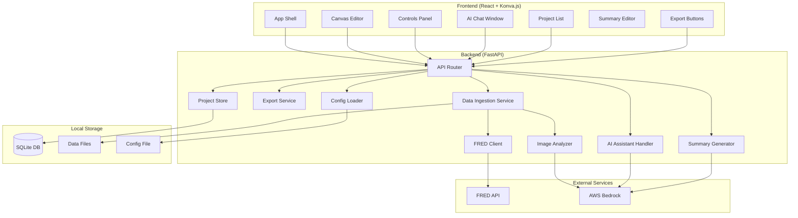

# Design Document: FRBSF Chart Builder

## Overview

The FRBSF Chart Builder is a single-user local web application for creating, customizing, and exporting FRBSF-branded economic charts. The system follows a client-server architecture with a FastAPI backend and a React + Konva.js frontend, communicating over a REST API. Data flows from ingestion (FRED API or file upload) through processing and chart rendering to export.

Key design decisions:
- **Konva.js for canvas rendering**: Provides a scene graph with per-element hit detection, drag-and-drop, and event handling — essential for the interactive chart editor.
- **SQLite for persistence**: Lightweight, zero-config, ideal for a single-user local app. Stores project metadata and chart state as JSON blobs.
- **AWS Bedrock for LLM/Vision**: Provides Claude models for natural language chart commands, executive summary generation, data Q&A, and vision-based reference chart analysis.
- **OpenCV + Bedrock Vision dual pipeline**: OpenCV handles deterministic extraction (colors, contours, OCR), while Bedrock Vision provides semantic understanding (chart type, layout intent). Combined results yield a robust chart specification.
- **Stateless API with session context**: The backend is stateless per request; conversation context for the AI assistant is maintained in-memory per chart session and reset on chart load/create.

## Architecture



### Request Flow

1. **Data Ingestion (FRED URL)**: Frontend → `POST /api/ingest/url` → FRED Client downloads data → stored in `data/` folder → chart spec generated → response with chart config
2. **Data Ingestion (File Upload)**: Frontend → `POST /api/ingest/upload` (multipart) → parse CSV/Excel → optionally analyze reference image → chart spec generated → response with chart config
3. **AI Chat**: Frontend → `POST /api/ai/chat` with message + chart context → AI Assistant classifies intent (chart modification vs data Q&A) → Bedrock call → response with either chart config delta or text answer
4. **Summary Generation**: Frontend → `POST /api/summary/generate` with dataset + chart context → Bedrock call → response with summary text
5. **Export**: Frontend → `GET /api/export/{format}` with chart state → Export Service generates artifact → response with file download
6. **Project CRUD**: Standard REST on `POST/GET/PUT/DELETE /api/projects`


## Components and Interfaces

### Backend Components

#### 1. Config Loader (`config.py`)

Loads and validates the config file at startup.

```python
class AppConfig:
    fred_api_key: str
    aws_region: str
    aws_access_key_id: str | None  # None if using IAM role/profile
    aws_secret_access_key: str | None
    bedrock_model_id: str  # default: "anthropic.claude-3-sonnet-20240229-v1:0"
    bedrock_vision_model_id: str  # default: "anthropic.claude-3-sonnet-20240229-v1:0"

def load_config(path: str = "config.yaml") -> AppConfig:
    """Load config from YAML file. Raises ConfigError with descriptive message on missing/invalid keys."""
```

Config file format (`config.yaml`):
```yaml
fred_api_key: "your-fred-key"
aws_region: "us-west-2"
aws_access_key_id: "AKIA..."       # optional if using IAM profile
aws_secret_access_key: "secret..." # optional if using IAM profile
bedrock_model_id: "anthropic.claude-3-sonnet-20240229-v1:0"
```

#### 2. FRED Client (`fred_client.py`)

```python
class FREDClient:
    def __init__(self, api_key: str): ...

    async def download_series(self, series_id: str) -> FREDDataset:
        """Download a FRED series by ID. Returns parsed dataset.
        Raises FREDAuthError on invalid key, FREDNotFoundError on invalid series."""

    def parse_fred_url(self, url: str) -> str:
        """Extract series ID from a FRED URL. Raises ValueError on invalid URL format."""
```

#### 3. Data Ingestion Service (`ingestion.py`)

```python
class DataIngestionService:
    def __init__(self, fred_client: FREDClient, image_analyzer: ImageAnalyzer): ...

    async def ingest_from_url(self, url: str) -> IngestionResult:
        """Download FRED data from URL, store locally, generate default chart spec."""

    async def ingest_from_file(
        self, file: UploadFile, reference_image: UploadFile | None = None
    ) -> IngestionResult:
        """Parse uploaded CSV/Excel, optionally analyze reference image, generate chart spec."""

    def _parse_csv(self, content: bytes) -> pd.DataFrame: ...
    def _parse_excel(self, content: bytes) -> pd.DataFrame: ...
    def _store_data(self, df: pd.DataFrame, filename: str) -> str:
        """Store DataFrame to data/ folder. Returns file path."""
```

#### 4. Image Analyzer (`image_analyzer.py`)

```python
class ImageAnalyzer:
    def __init__(self, bedrock_client: BedrockClient): ...

    async def analyze(self, image_bytes: bytes) -> ChartSpecification:
        """Run OpenCV + Bedrock Vision pipeline. Returns unified chart spec."""

    def _opencv_extract(self, image_bytes: bytes) -> OpenCVResult:
        """Extract colors, contours, text regions via OpenCV."""

    async def _bedrock_vision_analyze(self, image_bytes: bytes) -> VisionResult:
        """Send image to Bedrock Vision for semantic chart understanding."""

    def _merge_results(self, cv: OpenCVResult, vision: VisionResult) -> ChartSpecification:
        """Combine OpenCV and Vision results into unified spec."""
```

#### 5. AI Assistant Handler (`ai_assistant.py`)

```python
class AIAssistantHandler:
    def __init__(self, bedrock_client: BedrockClient): ...

    # In-memory session store: dict[str, list[Message]]
    _sessions: dict[str, list[dict]]

    async def handle_message(
        self, session_id: str, message: str, chart_context: ChartContext
    ) -> AIResponse:
        """Classify intent, route to chart modification or data Q&A, return response."""

    def reset_session(self, session_id: str) -> None:
        """Clear conversation history for a session."""

    async def _classify_intent(self, message: str) -> Literal["chart_modify", "data_qa"]:
        """Use Bedrock to classify user intent."""

    async def _handle_chart_modify(
        self, session_id: str, message: str, chart_context: ChartContext
    ) -> ChartConfigDelta:
        """Generate chart config changes from natural language command."""

    async def _handle_data_qa(
        self, session_id: str, message: str, chart_context: ChartContext
    ) -> str:
        """Answer data question using dataset context."""
```

#### 6. Summary Generator (`summary_generator.py`)

```python
class SummaryGenerator:
    def __init__(self, bedrock_client: BedrockClient): ...

    async def generate(self, dataset: pd.DataFrame, chart_context: ChartContext) -> str:
        """Generate executive summary with trend analysis, peaks/troughs, predictions."""
```

#### 7. Export Service (`export_service.py`)

```python
class ExportService:
    async def export_python(self, chart_state: ChartState) -> bytes:
        """Generate zip with chart.py (matplotlib) + requirements.txt."""

    async def export_r(self, chart_state: ChartState) -> bytes:
        """Generate zip with chart.R (ggplot2) + install_packages.R."""

    async def export_pdf(self, chart_state: ChartState, summary: str) -> bytes:
        """Generate PDF with chart image (300 DPI) + summary text, FRBSF branding."""
```

#### 8. Project Store (`project_store.py`)

```python
class ProjectStore:
    def __init__(self, db_path: str = "projects.db"): ...

    async def create(self, project: ProjectCreate) -> Project: ...
    async def get(self, project_id: str) -> Project | None: ...
    async def list_all(self) -> list[ProjectSummary]: ...
    async def update(self, project_id: str, data: ProjectUpdate) -> Project: ...
    async def delete(self, project_id: str) -> None: ...
```

#### 9. API Router (`api/`)

```
POST   /api/ingest/url              - Ingest from FRED URL
POST   /api/ingest/upload           - Upload CSV/Excel + optional reference image
POST   /api/ai/chat                 - Send chat message
POST   /api/ai/reset                - Reset AI session
POST   /api/summary/generate        - Generate executive summary
GET    /api/export/python/{id}      - Export as Python zip
GET    /api/export/r/{id}           - Export as R zip
GET    /api/export/pdf/{id}         - Export as PDF
GET    /api/projects                - List projects
POST   /api/projects                - Create project
GET    /api/projects/{id}           - Get project
PUT    /api/projects/{id}           - Update project
DELETE /api/projects/{id}           - Delete project
GET    /api/health                  - Health check
```

### Frontend Components

#### 1. App Shell (`App.tsx`)
Top-level layout: project list sidebar, main canvas area, controls panel, summary editor, export toolbar, AI chat overlay.

#### 2. Canvas Editor (`CanvasEditor.tsx`)
Konva.js `Stage` and `Layer` components. Renders chart elements as Konva nodes. Handles:
- Drag-and-drop for all chart elements
- Right-click context menu for text elements
- Real-time position updates on drag
- Re-rendering on chart config changes

#### 3. Chart Element Components
Each chart element type is a React-Konva component:
- `AxisElement` — renders axis lines, ticks, labels
- `DataSeriesElement` — renders line/bar data series
- `LegendElement` — renders legend box with entries
- `GridlineElement` — renders horizontal/vertical gridlines
- `AnnotationElement` — renders text annotations and vertical bands
- `DataTableElement` — renders data table below chart
- `TitleElement` — renders chart title

All elements are draggable and emit position change events.

#### 4. Controls Panel (`ControlsPanel.tsx`)
Sidebar with collapsible sections:
- Axis controls (labels, ranges, scale type)
- Chart type selector (line, bar, mixed)
- Series color pickers
- Font family/size selectors
- Legend visibility/position
- Gridline visibility/style
- Annotation editor
- Data table visibility toggle
- Label formatting options

#### 5. Context Menu (`ContextMenu.tsx`)
Floating menu rendered on right-click over text elements. Options: font size, font color, font family. Closes on outside click.

#### 6. AI Chat Window (`AIChatWindow.tsx`)
Floating overlay triggered by bottom-right icon. Contains message list, input field, undo button for last AI modification. Maintains visual conversation history.

#### 7. Summary Editor (`SummaryEditor.tsx`)
Editable text area below the canvas. Displays auto-generated summary. User edits are persisted.

#### 8. Project List (`ProjectList.tsx`)
Sidebar list showing saved projects with name and last-modified timestamp. Click to load, delete button per entry.

#### 9. Export Toolbar (`ExportToolbar.tsx`)
Buttons for Python, R, and PDF export. Triggers download on click.


## Data Models

### Backend Models

```python
# --- Config ---
class AppConfig(BaseModel):
    fred_api_key: str
    aws_region: str
    aws_access_key_id: str | None = None
    aws_secret_access_key: str | None = None
    bedrock_model_id: str = "anthropic.claude-3-sonnet-20240229-v1:0"
    bedrock_vision_model_id: str = "anthropic.claude-3-sonnet-20240229-v1:0"

# --- Data ---
class FREDDataset(BaseModel):
    series_id: str
    title: str
    units: str
    frequency: str
    observations: list[Observation]

class Observation(BaseModel):
    date: str  # ISO date
    value: float | None  # None for missing data points

# --- Image Analysis ---
class OpenCVResult(BaseModel):
    dominant_colors: list[str]  # hex colors
    text_regions: list[TextRegion]
    contour_data: list[ContourInfo]

class VisionResult(BaseModel):
    chart_type: str  # "line", "bar", "mixed"
    axis_config: AxisConfig
    legend_entries: list[LegendEntry]
    annotations: list[AnnotationSpec]
    data_table: DataTableSpec | None
    layout_description: str

class ChartSpecification(BaseModel):
    chart_type: str
    color_mappings: dict[str, str]  # series_name -> hex color
    font_styles: FontStyles
    axis_config: AxisConfig
    legend_layout: LegendLayout
    annotations: list[AnnotationSpec]
    data_table: DataTableSpec | None
    vertical_bands: list[VerticalBand]

# --- Chart Configuration ---
class ChartState(BaseModel):
    chart_type: str  # "line", "bar", "mixed"
    title: ChartElementState
    axes: AxesConfig
    series: list[SeriesConfig]
    legend: LegendConfig
    gridlines: GridlineConfig
    annotations: list[AnnotationConfig]
    data_table: DataTableConfig | None
    elements_positions: dict[str, Position]  # element_id -> {x, y}
    dataset_path: str
    dataset_columns: list[str]

class Position(BaseModel):
    x: float
    y: float

class ChartElementState(BaseModel):
    text: str
    font_family: str = "Arial"
    font_size: int = 14
    font_color: str = "#000000"
    position: Position

class AxesConfig(BaseModel):
    x_label: str
    y_label: str
    x_min: float | None = None
    x_max: float | None = None
    y_min: float | None = None
    y_max: float | None = None
    x_scale: str = "linear"  # "linear" | "logarithmic"
    y_scale: str = "linear"

class SeriesConfig(BaseModel):
    name: str
    column: str
    chart_type: str  # "line" | "bar"
    color: str  # hex
    line_width: float = 2.0
    visible: bool = True

class LegendConfig(BaseModel):
    visible: bool = True
    position: Position
    entries: list[LegendEntry]

class LegendEntry(BaseModel):
    label: str
    color: str
    series_name: str

class GridlineConfig(BaseModel):
    horizontal_visible: bool = True
    vertical_visible: bool = False
    style: str = "dashed"  # "solid" | "dashed" | "dotted"
    color: str = "#cccccc"

class AnnotationConfig(BaseModel):
    id: str
    type: str  # "text" | "vertical_band"
    text: str | None = None
    position: Position
    font_size: int = 10
    font_color: str = "#333333"
    band_start: str | None = None  # date for vertical bands
    band_end: str | None = None
    band_color: str | None = None

class DataTableConfig(BaseModel):
    visible: bool = False
    position: Position
    columns: list[str]
    font_size: int = 10

class FontStyles(BaseModel):
    title: FontSpec
    axis_label: FontSpec
    tick_label: FontSpec
    legend: FontSpec
    annotation: FontSpec

class FontSpec(BaseModel):
    family: str
    size: int
    color: str
    weight: str = "normal"

class LegendLayout(BaseModel):
    position: str  # "top", "bottom", "left", "right"
    orientation: str  # "horizontal", "vertical"

class VerticalBand(BaseModel):
    start_date: str
    end_date: str
    color: str
    opacity: float = 0.3

# --- AI ---
class ChartContext(BaseModel):
    chart_state: ChartState
    dataset_summary: str  # column names, row count, date range, basic stats
    dataset_sample: list[dict]  # first N rows as dicts

class AIResponse(BaseModel):
    type: str  # "chart_modify" | "data_qa"
    message: str  # text response to user
    chart_delta: ChartConfigDelta | None = None  # only for chart_modify

class ChartConfigDelta(BaseModel):
    """Partial chart state update. Only non-None fields are applied."""
    chart_type: str | None = None
    title: ChartElementState | None = None
    axes: AxesConfig | None = None
    series: list[SeriesConfig] | None = None
    legend: LegendConfig | None = None
    gridlines: GridlineConfig | None = None
    annotations: list[AnnotationConfig] | None = None
    data_table: DataTableConfig | None = None

# --- Project ---
class Project(BaseModel):
    id: str  # UUID
    name: str
    created_at: str  # ISO datetime
    updated_at: str  # ISO datetime
    chart_state: ChartState
    dataset_path: str
    summary_text: str = ""

class ProjectCreate(BaseModel):
    name: str
    chart_state: ChartState
    dataset_path: str
    summary_text: str = ""

class ProjectUpdate(BaseModel):
    name: str | None = None
    chart_state: ChartState | None = None
    summary_text: str | None = None

class ProjectSummary(BaseModel):
    id: str
    name: str
    updated_at: str

# --- Ingestion ---
class IngestionResult(BaseModel):
    dataset_path: str
    chart_state: ChartState
    dataset_info: DatasetInfo

class DatasetInfo(BaseModel):
    columns: list[str]
    row_count: int
    date_range: str | None  # "2020-01-01 to 2024-01-01"
    source: str  # "fred" | "upload"
```

### SQLite Schema

```sql
CREATE TABLE projects (
    id TEXT PRIMARY KEY,
    name TEXT NOT NULL,
    created_at TEXT NOT NULL,  -- ISO 8601
    updated_at TEXT NOT NULL,  -- ISO 8601
    chart_state TEXT NOT NULL, -- JSON blob
    dataset_path TEXT NOT NULL,
    summary_text TEXT DEFAULT ''
);

CREATE INDEX idx_projects_updated_at ON projects(updated_at DESC);
```

### Frontend State (React Context / Zustand)

```typescript
interface AppState {
  // Project
  currentProjectId: string | null;
  projects: ProjectSummary[];

  // Chart
  chartState: ChartState;
  chartHistory: ChartState[];  // undo stack
  historyIndex: number;

  // Data
  datasetInfo: DatasetInfo | null;

  // AI Chat
  chatMessages: ChatMessage[];
  chatSessionId: string;

  // Summary
  summaryText: string;

  // UI
  selectedElementId: string | null;
  contextMenuTarget: { elementId: string; x: number; y: number } | null;
  aiChatOpen: boolean;
  isLoading: boolean;
}

interface ChatMessage {
  role: 'user' | 'assistant';
  content: string;
  chartDelta?: ChartConfigDelta;  // if this message caused a chart change
  timestamp: string;
}
```


## Correctness Properties

*A property is a characteristic or behavior that should hold true across all valid executions of a system — essentially, a formal statement about what the system should do. Properties serve as the bridge between human-readable specifications and machine-verifiable correctness guarantees.*

### Property 1: Config loading round trip

*For any* valid config YAML file containing FRED API key and AWS credentials, loading the config via `load_config` should produce an `AppConfig` object whose fields exactly match the key-value pairs in the file.

**Validates: Requirements 1.1**

### Property 2: Config validation error specificity

*For any* config file with one or more missing or malformed keys, `load_config` should raise a `ConfigError` whose message contains the name of every missing or malformed key.

**Validates: Requirements 1.2**

### Property 3: Project save/load round trip

*For any* valid `Project` object (with name, chart state, dataset path, and summary text), saving it via `ProjectStore.create` and then loading it via `ProjectStore.get` should return a project whose name, chart_state, dataset_path, and summary_text are equal to the original, and whose id, created_at, and updated_at fields are non-empty.

**Validates: Requirements 2.1, 2.2, 2.3, 2.5, 12.5**

### Property 4: Project deletion removes record

*For any* project that has been created in the ProjectStore, calling `delete` with that project's ID and then calling `get` with the same ID should return `None`.

**Validates: Requirements 2.4**

### Property 5: FRED URL parsing extracts series ID

*For any* valid FRED URL of the form `https://fred.stlouisfed.org/series/{SERIES_ID}`, `parse_fred_url` should extract and return the correct series ID string. For any URL not matching this pattern, it should raise a `ValueError`.

**Validates: Requirements 3.1**

### Property 6: Data file storage round trip

*For any* valid pandas DataFrame, storing it via `_store_data` and then reading the resulting file back should produce a DataFrame equal to the original.

**Validates: Requirements 3.2**

### Property 7: Chart generation from valid data

*For any* valid dataset (with at least one numeric column and a date/index column) and any supported chart type ("line", "bar", "mixed"), generating a chart should produce a `ChartState` with the correct chart_type, at least one series config, valid axes config, and FRBSF default branding colors and fonts.

**Validates: Requirements 3.3, 6.2, 6.3**

### Property 8: Invalid URL rejection

*For any* string that is not a valid FRED URL (random strings, malformed URLs, URLs to other domains), the ingestion service should return a descriptive error rather than a successful result.

**Validates: Requirements 3.4**

### Property 9: File parsing produces correct tabular data

*For any* valid CSV or Excel byte content representing a table with N rows and M columns, parsing via `_parse_csv` or `_parse_excel` should produce a DataFrame with exactly N rows and M columns, with column names matching the header row.

**Validates: Requirements 4.1, 4.2**

### Property 10: Invalid file rejection

*For any* file with an unsupported extension (not .csv, .xlsx, .xls), the ingestion service should return an error message that mentions the accepted formats. *For any* file with a supported extension but malformed/unparseable content, the service should return a descriptive parsing error rather than crashing.

**Validates: Requirements 4.3, 4.4**

### Property 11: Image analysis merge produces complete specification

*For any* pair of `OpenCVResult` and `VisionResult`, the `_merge_results` function should produce a `ChartSpecification` that contains a non-empty chart_type, at least one color mapping, valid font_styles, and a valid axis_config.

**Validates: Requirements 5.3**

### Property 12: ChartSpecification to ChartState conversion

*For any* valid `ChartSpecification`, converting it to a `ChartState` should produce a state whose chart_type matches the spec's chart_type, whose series colors match the spec's color_mappings, and whose font styles match the spec's font_styles.

**Validates: Requirements 5.5**

### Property 13: Element position update persistence

*For any* chart element ID and any new `Position(x, y)`, updating the element's position in the `ChartState.elements_positions` dict should result in the stored position matching the new coordinates exactly.

**Validates: Requirements 7.3**

### Property 14: Chart element property changes applied correctly

*For any* text-based chart element and any valid property change (font_size, font_color, font_family), applying the change to the element's state should result in the element's corresponding property matching the new value, with all other properties unchanged.

**Validates: Requirements 8.2, 9.5**

### Property 15: AI session lifecycle

*For any* sequence of N messages sent to the same session ID, the session's conversation history should contain exactly N entries in order. After calling `reset_session`, the history should be empty.

**Validates: Requirements 10.3, 10.4, 10.5**

### Property 16: AI intent classification output domain

*For any* user message string, the intent classifier should return exactly one of `"chart_modify"` or `"data_qa"` — never any other value.

**Validates: Requirements 13.2**

### Property 17: AI response structure validity

*For any* AI response classified as `"chart_modify"`, the response should contain a non-null `ChartConfigDelta`. *For any* response classified as `"data_qa"`, the response should contain a non-empty `message` string and a null `chart_delta`.

**Validates: Requirements 11.1, 13.1**

### Property 18: ChartConfigDelta application produces valid state

*For any* valid `ChartState` and any valid `ChartConfigDelta`, applying the delta to the state should produce a new `ChartState` that passes validation — all required fields present, chart_type is one of the supported types, and all series configs reference valid columns.

**Validates: Requirements 11.2**

### Property 19: Undo restores previous state

*For any* `ChartState` and any `ChartConfigDelta` applied to it, undoing the modification should restore the chart state to be exactly equal to the state before the delta was applied.

**Validates: Requirements 11.3**

### Property 20: Summary generation returns non-empty result

*For any* valid dataset (non-empty DataFrame) and chart context, the summary generator should return a non-empty string.

**Validates: Requirements 12.1**

### Property 21: Python export produces valid self-contained zip

*For any* valid `ChartState` with embedded dataset, the Python export should produce a zip archive containing exactly `chart.py` and `requirements.txt`. The `requirements.txt` should list `matplotlib` and `pandas`. The `chart.py` should contain valid Python syntax and embed all dataset values.

**Validates: Requirements 14.1, 14.2, 14.3**

### Property 22: R export produces valid self-contained zip

*For any* valid `ChartState` with embedded dataset, the R export should produce a zip archive containing exactly `chart.R` and `install_packages.R`. The `chart.R` should contain ggplot2 code and embed all dataset values as an inline data frame.

**Validates: Requirements 15.1, 15.2, 15.3**

### Property 23: PDF export produces valid document

*For any* valid `ChartState` and non-empty summary string, the PDF export should produce a valid PDF byte stream. The rendered chart image within the PDF should have dimensions corresponding to at least 300 DPI at the target print size.

**Validates: Requirements 16.1, 16.2**


## Error Handling

### Backend Error Strategy

All errors are returned as structured JSON responses with appropriate HTTP status codes:

```python
class ErrorResponse(BaseModel):
    error: str       # error code (e.g., "CONFIG_MISSING_KEY", "FRED_AUTH_ERROR")
    message: str     # human-readable description
    details: dict | None = None  # optional additional context
```

| Error Scenario | HTTP Status | Error Code | Details |
|---|---|---|---|
| Config file missing | 500 | `CONFIG_FILE_NOT_FOUND` | Path attempted |
| Config key missing/malformed | 500 | `CONFIG_INVALID` | List of missing/malformed keys |
| FRED API key invalid | 401 | `FRED_AUTH_ERROR` | — |
| FRED URL invalid | 400 | `INVALID_FRED_URL` | URL provided |
| FRED series not found | 404 | `FRED_SERIES_NOT_FOUND` | Series ID |
| FRED API unreachable | 502 | `FRED_API_UNAVAILABLE` | — |
| Unsupported file format | 400 | `UNSUPPORTED_FILE_FORMAT` | Accepted formats list |
| File parsing error | 400 | `FILE_PARSE_ERROR` | Parser error message |
| Image analysis failure | 422 | `IMAGE_ANALYSIS_FAILED` | Failure reason |
| Bedrock API error | 502 | `BEDROCK_API_ERROR` | Model ID, error type |
| Project not found | 404 | `PROJECT_NOT_FOUND` | Project ID |
| Invalid chart state | 422 | `INVALID_CHART_STATE` | Validation errors |
| Export generation failure | 500 | `EXPORT_FAILED` | Export type, reason |

### Frontend Error Handling

- API errors are caught by a centralized error handler in the HTTP client layer
- Errors are displayed as toast notifications with the `message` field
- Network errors (no connection to backend) show a persistent banner
- File upload errors show inline validation messages near the upload control
- AI chat errors are displayed as system messages in the chat window

### Retry Strategy

- FRED API calls: retry up to 3 times with exponential backoff (1s, 2s, 4s)
- Bedrock API calls: retry up to 2 times with 2s delay
- No retry for validation errors (4xx status codes)

## Testing Strategy

### Dual Testing Approach

This project uses both unit tests and property-based tests for comprehensive coverage:

- **Unit tests** verify specific examples, edge cases, integration points, and error conditions
- **Property-based tests** verify universal properties across randomly generated inputs
- Both are complementary — unit tests catch concrete bugs, property tests verify general correctness

### Property-Based Testing Configuration

- **Library**: [Hypothesis](https://hypothesis.readthedocs.io/) for Python backend tests
- **Minimum iterations**: 100 per property test (`@settings(max_examples=100)`)
- **Each property test references its design document property** via tag comment:
  ```python
  # Feature: frbsf-chart-builder, Property 1: Config loading round trip
  ```
- **Each correctness property is implemented by a single property-based test**

### Test Organization

```
tests/
├── unit/
│   ├── test_config.py           # Config loading examples, edge cases
│   ├── test_fred_client.py      # URL parsing examples, mock API responses
│   ├── test_ingestion.py        # CSV/Excel parsing examples, error cases
│   ├── test_image_analyzer.py   # Merge function examples, error cases
│   ├── test_ai_assistant.py     # Session management, intent routing examples
│   ├── test_summary.py          # Summary generation with mock Bedrock
│   ├── test_export.py           # Export output structure, content examples
│   ├── test_project_store.py    # CRUD operation examples
│   └── test_chart_state.py      # Delta application, position updates
├── property/
│   ├── test_config_props.py     # Properties 1-2
│   ├── test_project_props.py    # Properties 3-4
│   ├── test_ingestion_props.py  # Properties 5-6, 8-10
│   ├── test_chart_props.py      # Properties 7, 12-14, 18-19
│   ├── test_image_props.py      # Property 11
│   ├── test_ai_props.py         # Properties 15-17
│   ├── test_summary_props.py    # Property 20
│   └── test_export_props.py     # Properties 21-23
└── conftest.py                  # Shared fixtures, Hypothesis strategies
```

### Hypothesis Custom Strategies

Key generators needed for property tests:

```python
# Strategy for generating valid AppConfig
valid_configs = builds(AppConfig, ...)

# Strategy for generating valid ChartState
valid_chart_states = builds(ChartState, ...)

# Strategy for generating valid DataFrames (with date index + numeric columns)
valid_dataframes = ...

# Strategy for generating valid ChartConfigDelta
valid_deltas = builds(ChartConfigDelta, ...)

# Strategy for generating valid CSV/Excel byte content
valid_csv_bytes = ...

# Strategy for FRED URLs
valid_fred_urls = ...
invalid_fred_urls = ...
```

### Unit Test Focus Areas

- **Config**: missing file, empty file, partial keys, malformed YAML
- **FRED Client**: URL variations, mock API success/failure responses
- **Ingestion**: empty CSV, single-row CSV, multi-sheet Excel, encoding issues
- **Image Analyzer**: merge with missing fields, empty results
- **AI Assistant**: session creation, message accumulation, reset, intent examples
- **Export**: specific chart configurations, edge cases (no data, single point)
- **Project Store**: concurrent access, large chart states, special characters in names

### Frontend Testing

- **React Testing Library** for component rendering and interaction tests
- **Konva.js testing** via `react-konva` test utilities for canvas element tests
- Focus on: context menu behavior, drag event handling, controls panel state propagation, chat window interaction flow

